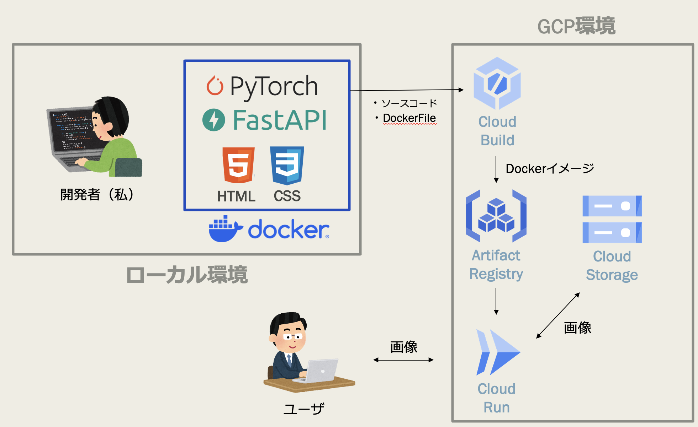

# CycleGANベースの影除去AIアプリ（GCPデプロイ）

このプロジェクトは、FastAPIを使った画像変換Webアプリケーションです。

ユーザーが画像をアップロードすると、CycleGANモデルが自動で影を除去した画像に変換します。  
操作はシンプルで、HTTP API経由で誰でもすぐに使うことができます。

アプリはDockerコンテナで動作し、Google Cloud Runにワンクリックでデプロイできる設計になっています。


---

## ✨ デモ

実際に動作するwebアプリはこちらからアクセスできます。

 [Remove Shadow App (デモリンク)](https://remove-shadow-app-1073918449956.asia-northeast1.run.app/)

- ※無料枠のため、コールドスタート
- ※友人の顔専用モデルを公開しているため、test_dataをご使用ください。

### 入出力イメージ


---

## 🛠️ 使用技術
- Python 3.9
- FastAPI
- Uvicorn
- PyTorch
- Docker
- Google Cloud Run

---
## 🏗️ アーキテクチャ概要図


---
## 🚀 セットアップ手順

### 1. リポジトリをクローン

```bash
git clone https://github.com/popcorn-wataroger/remove_shadow_app.git
cd remove_shadow_app
```
### 2. Dockerイメージをビルド
```bash
docker build -t cyclegan-api .
```
### 3. ローカルで起動
```bash
docker run -p 8080:8080 cyclegan-api
```
ブラウザで http://localhost:8080/docs にアクセスすると、Swagger UI（APIドキュメント）が確認できます！

---

## 📷 APIエンドポイント
```
POST /convert-a2b/
```
アップロードされた画像を、CycleGANモデルで影除去変換し、変換後の画像（PNG）を返します。

### 🔹 リクエスト仕様

- **HTTPメソッド**：`POST`
- **エンドポイントURL**：`/convert-a2b/`
- **リクエスト形式**：`multipart/form-data`
- **送信するデータ**：
  - フィールド名：`file`
  - 内容：変換したい**画像ファイル**（JPG, PNGなど）

### 🔹 レスポンス仕様

- **HTTPステータス**：`200 OK`
- **レスポンス内容**：
  - 変換後の画像ファイル（**PNG形式**）

### 🔹 具体例（curlコマンド）

以下のコマンドで、ローカルサーバーに画像をアップロードし、  
変換後の画像を `output_image.png` として保存します。


例（curlコマンド）：
```bash
curl -X POST "http://localhost:8080/convert-a2b/" \
  -H "accept: image/png" \
  -H "Content-Type: multipart/form-data" \
  -F "file=@input_image.jpg" \
  --output output_image.png
```
レスポンス：変換後の画像ファイル（PNG形式）

---

## ☁️ Google Cloud Runへのデプロイ手順（オプション）
### 1. デプロイ前提条件
本プロジェクトをGoogle Cloud Runにデプロイするためには、以下の準備が必要です。

- **GCPアカウント作成**（およびプロジェクト作成）
- **GCS（Google Cloud Storage）バケット作成**
  - 変換前後の画像を保存するために使用します
- **Google Cloud SDKのインストール**
  - ローカルからGCPの各種サービス（Cloud Build、Cloud Runなど）へコマンドライン操作できるようにします
  - [SDK公式インストールガイド](https://cloud.google.com/sdk/docs/install)

### 2. Google Cloud Buildでビルド
```bash
gcloud builds submit --tag gcr.io/<YOUR_PROJECT_ID>/cyclegan-api
```
### 3. Cloud Runにデプロイ
```bash
gcloud run deploy cyclegan-api \
  --image gcr.io/<YOUR_PROJECT_ID>/cyclegan-api \
  --platform managed \
  --region us-central1 \
  --allow-unauthenticated
```
※ Cloud Runが自動でスケールし、サーバレスで公開されます。

---

## 🧠 今後の改善アイデア
- ユーザー認証機能（OAuth2/JWT）
- 非同期キューを使ったバックグラウンド処理
- Reactなどを使ったアップロード用フロントエンド実装

